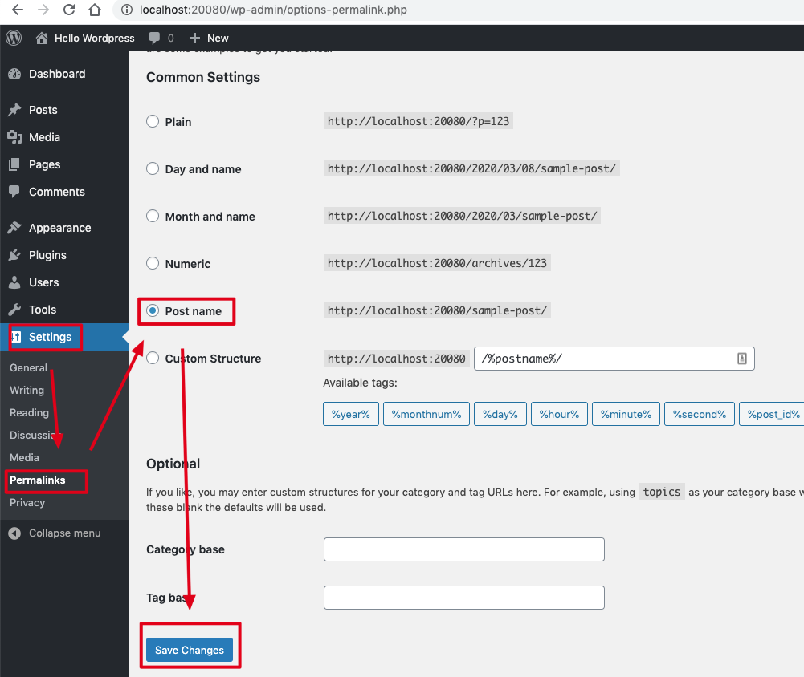
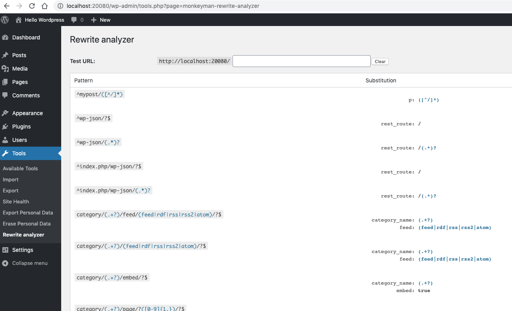

Docker Wordpress Rewrite Rule Demo
==================================

Rewrite Rule是用于重定义url结构，重写到另一个url或者php文件。

这里面坑非常多，需要仔细研究：

1. 需要在wordpress后台Permalink启用非plain的选项，它将会`.htaccess`中启用rewrite rule

   

2. Wordpress中Rewrite Rule有两种：
   - 一种是利用了apache的`.htaccess`文件中定义的规则，在apache层面上起作用。这种主要是定义到index.php的基本规则，以及到非index.php的其它规则
   - 另一种是在index.php的基础上有更多的花样，相关的规则是在wordpress内部维护

3. 对于重写到index.php的规则，有wordpress内部的定义，比如regex中可以使用`^`，在query string中可以使用`$matches[1]`。
   对于到其它文件的规则，只能按Apache rewrite rule来写，不能使用`^`，query string中用`$1`
   
4. 新添加的rewrite rule不一定生效，有两种办法：
   1. 调用`flush_rewrite_rules()`，理论上它会将新规则写入到`.htaccess`，但有时候不起作用
   2. 在后台Permalink处点一下"Save Changes"，比较保险

5. 在apache层面上进行的rewrite，新url中的参数可以通过`$_GET[key]`获取。
   在index.php上进行的rewrite，新参数由WP_Query处理，需要`get_query_var`，对于新参数，还需要`add_rewrite_tag`(需要用于post url结构中)，或者单纯的获取`add_filter('query_vars', ...);`

6. 查看或者验证rewrite rule，可以安装 https://wordpress.org/plugins/monkeyman-rewrite-analyzer/

   
   
   注意：它仅会显示到index.php的rewrite rule

修改的文件：

- WordPress-5.3.2/wp-includes/functions.php
- WordPress-5.3.2/my-custom-rewrite-rules.php
- WordPress-5.3.2/my-page.php

这个文章非常好：
- https://www.pmg.com/blog/a-mostly-complete-guide-to-the-wordpress-rewrite-api/?cn-reloaded=1

```
npm run up
```

当前登录wordpress的用户名和密码是：

```
freewind
123456
```

访问：

- http://localhost:20080/mypost/1
- http://localhost:20080/hello/aaa/bbb